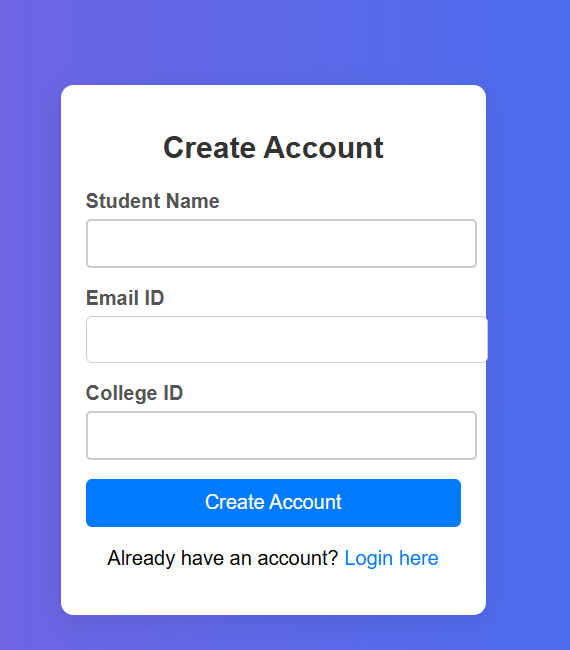
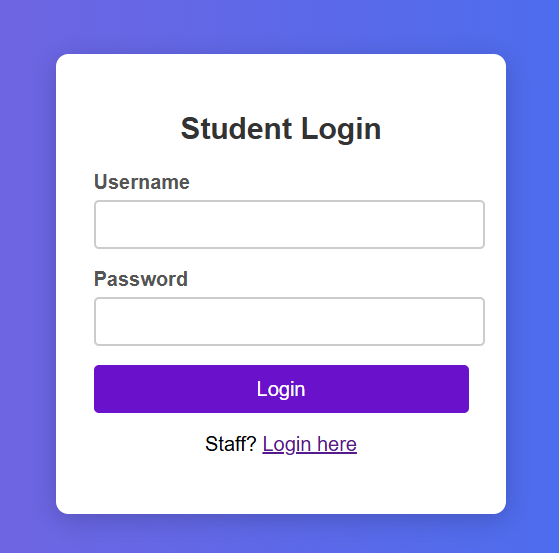
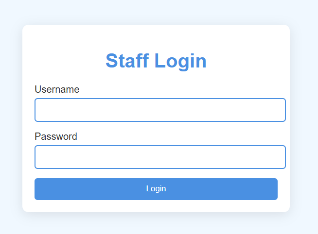
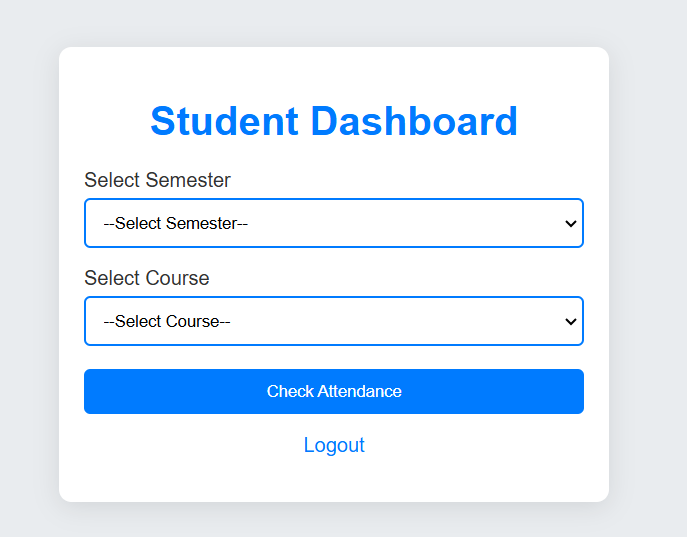
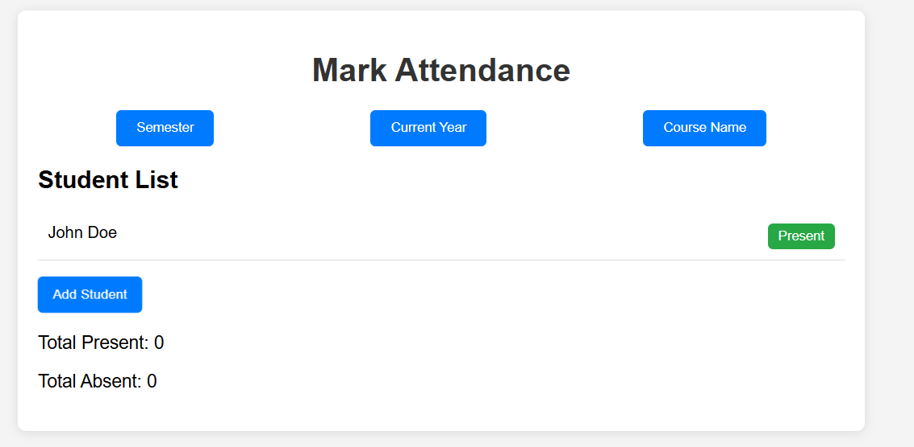

# Student Attendance System

This project is a simple web-based Student Attendance System that allows staff members to log in and mark student attendance. The application provides a user-friendly interface for managing student attendance records and uses MySQL for database management and PHP for server-side logic.

It also allows Student to check their attendance.

## Features

- Staff login page to authenticate users
- Student Login to check attendance
- Attendance marking page for recording student attendance
- Simple form validation
- Displays submitted attendance records
- Data is stored in a MySQL database

## Technologies Used

- HTML
- CSS
- JavaScript
- PHP
- MySQL

## Project Images







## Getting Started

1. Clone the repository:
   ```bash
   git clone https://github.com/yourusername/student-attendance-system.git
